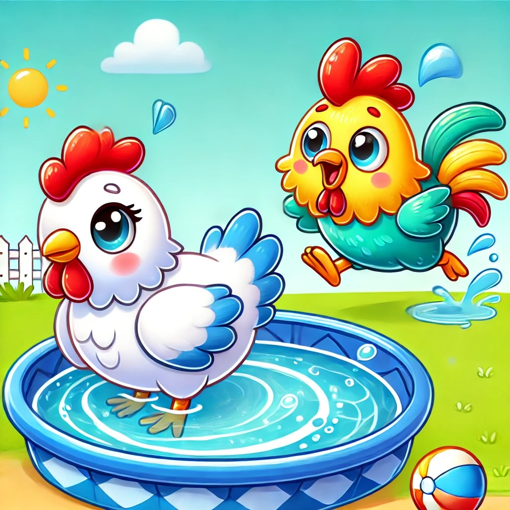

# Play Chicken!

[](https://github.com/anagrambuild/play_chicken/actions/workflows/forge-ci.yml)
[](https://github.com/anagrambuild/play_chicken/actions/workflows/commit-lint.yml)
[](https://github.com/anagrambuild/play_chicken/actions/workflows/yamlfmt.yml)
[](https://github.com/anagrambuild/play_chicken/actions/workflows/ci-lint.yml)
[](https://github.com/anagrambuild/play_chicken/actions/workflows/sepolia-testnet.yml)



**Chicken Pools** aim to enhance holding times for meme coins by introducing time-based pools where participants strategically plan their exits within incentivized time frames. This shift focuses on "when to sell" rather than simply "holding for long periods," allowing for higher engagement and reward opportunities over intervals ranging from 15 minutes to 5 days. 

### Pool Mechanics & Design Considerations

In designing Chicken Pools, the project team is addressing several unique pool mechanics to encourage active participation without relying on prolonged engagement. Key design elements include:

- **Reward and Payout Models**: The team is evaluating whether to use time-based rewards that distribute payouts based on participant timing or a binary winner/loser approach. Additionally, different payout triggers are being explored, such as selling thresholds at 50% or 75% of initial pool deposits, to create predictable yet strategic incentives.

- **Creator Incentives**: To boost pool creation, creators are allowed to contribute initial deposits and potentially receive additional incentives. These incentives make starting new pools attractive and provide a wider selection of options for players.

Chicken Pools encourage faster-paced decision making, appealing to users interested in short-term, high-engagement scenarios where timing and exit strategy are key.

### Technical Architecture & Development

Key aspects of the technical architecture include:

- **Smart Contract-Based Actions**: All player actions, including deposits, withdrawals, and claims, are processed through the smart contract, eliminating the need for complex wallet monitoring. This allows the contract itself to manage all relevant checks, validations, and balances.

- **Multi-Interface Support**: The contract will support integration with multiple interfaces, including web-based UI, in-app functionality, and Telegram. This multi-interface approach ensures accessibility across various platforms, allowing users to interact with Chicken Pools from wherever is most convenient.

The project’s overall goal is to provide a reliable, high-engagement experience for meme coin holders, emphasizing short-term rewards and active decision-making. Chicken Pools aims to create a vibrant ecosystem where participants can focus on strategic timing without the need for extensive holding periods or complex monitoring. This approach intends to tap into the rapid cycles of meme coin popularity, aligning with user interests in shorter, strategic trading windows.

## Contract Architecture and Description

The "Chicken Pools" smart contract provides a decentralized pool structure where participants (players) can join timed pools with a designated start and end block. Key features include entry requirements, reward distribution, penalty for early exit, and a 1% protocol fee. Players have the opportunity to claim rewards by being the "last player standing" or waiting until the pool closes.

### Key Components and Functionalities

1. **Pool Creation**:
   - Each pool (referred to as a "chicken pool") is created with a start and end block, a specified reward amount, and a minimum deposit requirement.
   - The pool creator must transfer the reward amount plus a 1% protocol fee to the contract.
   - Pools are identified by a unique `chickenId` and stored in the `chickens` mapping.

2. **Deposit and Join Mechanism**:
   - Players can join a pool by depositing tokens before the start block.
   - The deposited amount must meet or exceed the minimum deposit requirement.
   - Multiple deposits from the same player are allowed, and each player’s balance is tracked within the pool.

3. **Reward Distribution and Claim**:
   - Reward distribution follows a "last player standing" model.
   - A player can claim the reward after the pool ends or if they are the last remaining player.
   - If the pool ends naturally, rewards are distributed proportionally based on each player’s deposit.
   - Players who exit the pool early face penalties and forfeit rewards.

4. **Early Exit Penalty (Chicken Out)**:
   - Players can withdraw their deposits before the pool’s end block but do not receive any portion of the reward.
   - Exiting early (referred to as "chickening out") triggers a deduction from the total deposits in the pool.

5. **Protocol Fee**:
   - A 1% protocol fee, deducted from the reward amount, is required for pool creation.
   - The protocol can withdraw accumulated fees periodically.

6. **Escrow Model**:
   - A full token escrow model is implemented, where the contract holds all tokens until they are distributed.
   - The protocol does not support partial deposits or withdrawal tracking outside of the pool's lifecycle.

7. **SPAM Mitigation**:
   - Effective spam mitigation is essential within the Chicken Pools framework. To this end, each pool creator is required to post a native token bond as a deterrent against misuse. This bond serves as a stake entitling the creator to initiate unlimited pools. 

   At any chosen time, a creator may request the withdrawal of their bond; however, a timelock mechanism will enforce a 7-day delay before the bond can be retrieved. This approach ensures that the bond amount is substantial enough to discourage malicious behavior while remaining accessible to legitimate users, balancing deterrence with usability.

### Contract Structure

- **Data Structures**:
  - **Chicken Struct**: Stores all relevant pool data, including reward amount, total deposits, start and end blocks, and individual player balances.
  - **Player Management**: Utilizes an `AddressSet` to maintain a unique list of players within each pool.

- **Events**:
  - Events are emitted to track key actions, including pool creation, player joins, reward claims, early exits, and protocol fee adjustments.

- **Error Handling**:
  - The contract includes specific error messages to provide clarity on failed actions (e.g., `ChickenMustStartInFuture`, `PlayerIsNotInChickenPool`).

### Technical Considerations

- **Chain Compatibility**: The contract is designed for compatibility with both EVM and Solana, allowing flexibility for deployment on either chain.
- **Monorepo Structure**: Development will proceed in a monorepo structure to unify contract logic and facilitate streamlined testing and deployment.
- **Economic Modeling**:
  - The current economic model imposes a full penalty for early withdrawals.
  - The "last person standing" rule incentivizes strategic exit timing and potentially maximizes returns for patient participants.
  - Consideration is given to automating USDC conversion on withdrawal for a stable payout option.

- **UI and Simulator Development**:
   - The UI, developed in React, will provide a user-friendly interface for managing and monitoring chicken pools.
   - An enhanced simulator will include features such as volatile token price modeling, exponential decay patterns, and market shock scenarios.

- **Future Extensions**:
   - Considerations for social trading features, cross-pool incentives, and interactive UI components for longer-term pools may be integrated based on user feedback and market demands.


### Deployment Details

#### Deployment Instructions

##### Ethereum

A script is provided to fully support automated deployment of this Chicken Pool

For every step, an RPC node provider and a gas fee paying EOA should be setup as follows:
   - set an environment variable `RPC_URL` to the address of your RPC node provider
   - set an environment variable `PRIVATE_KEY` to the address of your deployment EOA

1. **Deploy a ChickenPool with TransparentUpgradeableProxy pattern**
   - set an environment variable `CHICKEN_POOL_ADMIN` to the address of the pool administrator, a multisig or timelock is recommended
   - set an environment variable `PROTOCOL_ADMIN` to the administrator of the protocol
   - Notes: `CHICKEN_POOL_ADMIN` will be able to perform upgrades, while `PROTOCOL_ADMIN` will be able to make protocol changes.  
     The EOA that invokes this call will pay the gas fees.  Be sure to make a note of the `ProxyAdmin` that is created by the Transparent Proxy.
```shell
$ forge script ./script/PlayChicken.s.sol:DeployPlayChickenScript --sig 'deployTransparentProxy()' --legacy --slow --broadcast --rpc-url ${RPC_URL} --private-key ${PRIVATE_KEY}
```

2. **Optional: Upgrade ChickenPool with the latest contract version**
   - set an environment variable `PROXY_ADMIN` to the admin created previously (Step 1)
   - set an environment variable `PLAY_CHICKEN_PROXY` to the address of the proxy deployed previously (Step 1)
   - Notes:  Only the `CHICKEN_POOL_ADMIN` may perform this operation
```shell
$ forge script ./script/PlayChicken.s.sol:DeployPlayChickenScript --sig 'upgradeTransparentProxy()' --legacy --slow --broadcast --rpc-url ${RPC_URL} --private-key ${PRIVATE_KEY}
```   

### Deployment Adressess

| Network | Address                                    | Contract                    | Notes                       | Verified                                                                        |
| ------- | ------------------------------------------ | --------------------------- | --------------------------- | ------------------------------------------------------------------------------- |
| Sepolia | 0xd9bf5f4C94dED9558f8385C90b4f372f709c1F4B | ProxyAdmin                  | Transparent Proxy Delegate  | https://sepolia.etherscan.io/address/0xd9bf5f4c94ded9558f8385c90b4f372f709c1f4b |
| Sepolia | 0x896d6e05a6b74E0D82660426e25b789003C404Fd | TransparentUpgradeableProxy | Chicken Pool Proxy          | https://sepolia.etherscan.io/address/0x896d6e05a6b74e0d82660426e25b789003c404fd |
| Sepolia | 0x5C8a691f42fa413466ca447bcCC6FC85f6cfb3ba | PlayChicken                 | Chicken Pool Implementation | https://sepolia.etherscan.io/address/0x5C8a691f42fa413466ca447bcCC6FC85f6cfb3ba |


## Foundry

**Foundry is a blazing fast, portable and modular toolkit for Ethereum application development written in Rust.**

Foundry consists of:

-   **Forge**: Ethereum testing framework (like Truffle, Hardhat and DappTools).
-   **Cast**: Swiss army knife for interacting with EVM smart contracts, sending transactions and getting chain data.
-   **Anvil**: Local Ethereum node, akin to Ganache, Hardhat Network.
-   **Chisel**: Fast, utilitarian, and verbose solidity REPL.

## Documentation

https://book.getfoundry.sh/

## Usage

### Build

```shell
$ forge build
```

### Test

```shell
$ forge test
```

### Format

```shell
$ forge fmt
```

### Gas Snapshots

```shell
$ forge snapshot
```

### Anvil

```shell
$ anvil
```

### Deploy

```shell
$ forge script ./script/PlayChicken.s.sol:DeployPlayChickenScript --sig 'deployProxyAdmin()' --legacy --slow --broadcast --rpc-url ${RPC_URL} --private-key ${PRIVATE_KEY}
```

### Cast

```shell
$ cast <subcommand>
```

### Help

```shell
$ forge --help
$ anvil --help
$ cast --help
```
